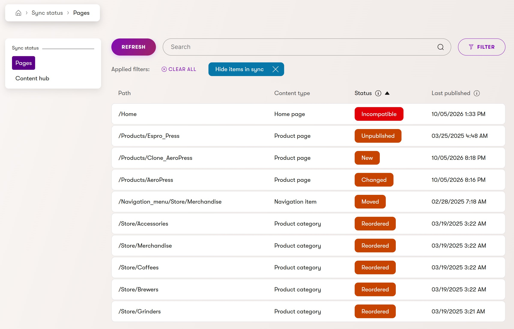
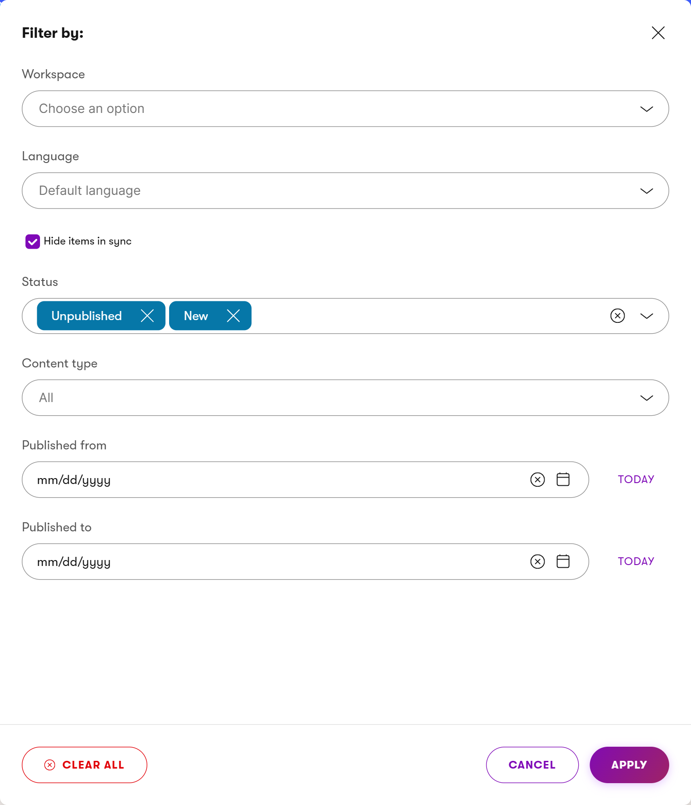
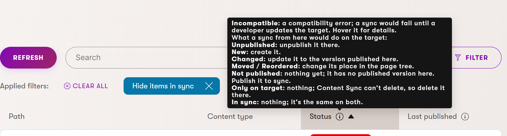
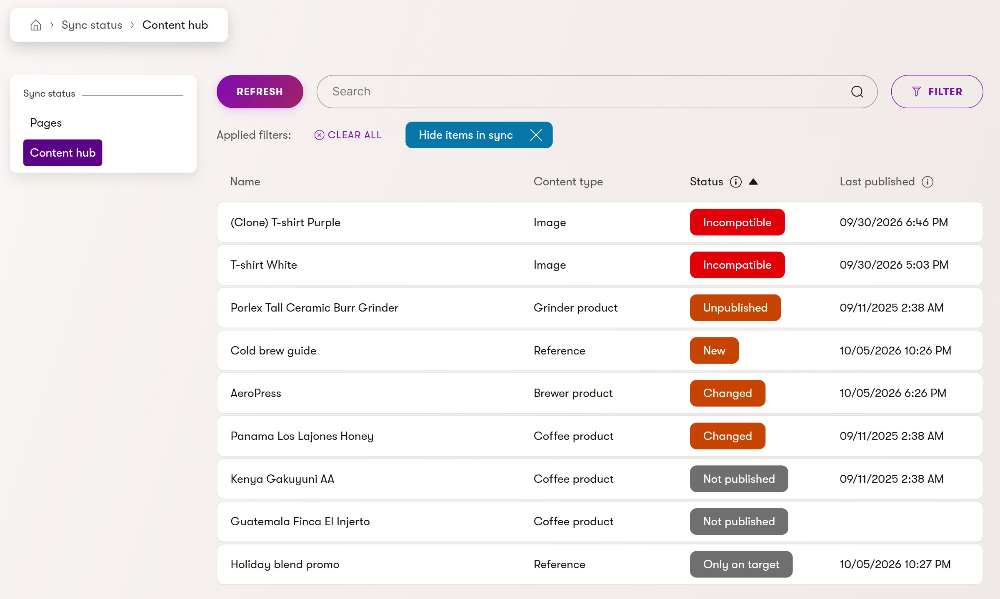
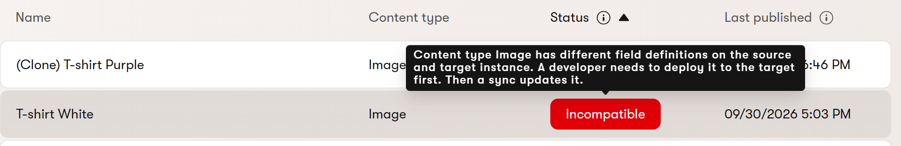
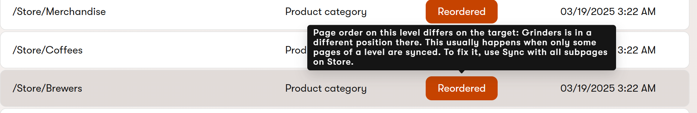
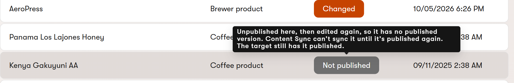
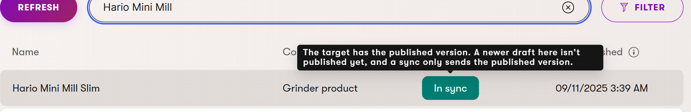

# Usage Guide

Content Sync Toolkit shows which content on one Xperience by Kentico instance
(the **source**) is missing from or out of date on another (the **target**),
so editors can see what Xperience's Content Sync still needs to push.

The toolkit is in beta. See the [README](../README.md) for status and the
[compatibility policy](Compatibility.md) for supported Xperience versions.

## How it works

Install the toolkit on **both** instances:

- The **target** answers inventory requests from the source: a list of its
  items' identities and publish timestamps. No field values leave the
  instance.
- The **source** compares its own content with the target's inventory and
  shows the result in the **Sync status** admin application.

An instance can be a source, a target, or both. Content Sync itself requires
source and target to run the same Xperience version; run the same toolkit
version on both as well.

## Install the package

On each instance:

```powershell
dotnet add package XperienceCommunity.ContentSyncToolkit --prerelease
```

## Register the toolkit

In `Program.cs` on each instance:

```csharp
using XperienceCommunity.ContentSyncToolkit;
using XperienceCommunity.ContentSyncToolkit.Admin;

builder.Services.AddContentSyncToolkit();
builder.Services.Configure<ContentSyncToolkitOptions>(
    builder.Configuration.GetSection("ContentSyncToolkit"));

// Optional: RequestTimeout and InventoryCacheDuration (see below).
// Source instances only: adds the Sync status admin application.
builder.Services.AddContentSyncToolkitAdmin();
```

The target's inventory endpoint is an attribute-routed controller under
`/xperience-community/content-sync-toolkit/inventory/`. It's served by the
same controller routing Xperience sites already use (`MapControllerRoute` or
`MapControllers`).

## Configure source and target

There's nothing toolkit-specific to configure: the toolkit uses Xperience's
own Content Sync configuration
([Content sync configuration](https://docs.kentico.com/documentation/developers-and-admins/configuration/content-sync-configuration)).

| Content Sync setting | What the toolkit does with it |
| --- | --- |
| `Source:Enabled` + `Source:TargetUrl` | This instance is a source, and the status page compares against that target. |
| `Source:Secret` | Sent with the toolkit's inventory requests. |
| `Target:Enabled` | This instance answers the toolkit's inventory requests. |
| `Target:Secret` | Required on those requests. |

So the page always compares against the instance Content Sync pushes to, with
the same secret. That adds no exposure: whoever holds the secret can already
push content to the target. Content Sync requires the target on HTTPS with a
trusted certificate, so the toolkit's requests use HTTPS too.

If Content Sync isn't configured as a source, the status page shows a banner
saying so; if it isn't configured as a target, the target rejects inventory
requests. The toolkit has no purpose without Content Sync.

Two optional toolkit settings tune the source's requests:

```json
{
  "ContentSyncToolkit": {
    "RequestTimeout": "00:00:30",
    "InventoryCacheDuration": "00:01:30"
  }
}
```

| Setting | Default | Meaning |
| --- | --- | --- |
| `RequestTimeout` | 30 seconds | Timeout for requests to the target. |
| `InventoryCacheDuration` | 90 seconds | How long the target's inventory is cached on the source. The source's own content is never cached. |

## Give editors access

The **Sync status** application (under **Content management**) uses
Xperience's standard **View** permission. Administrators have it
automatically. For other users, open **Role management**, edit a role,
**Add permission set**, and choose **For** *Sync status* **allow users
to** *View*. Users without it don't see the application, and direct
navigation to it is refused.

Within the application, editors only see what they could open in Xperience
itself:

- **Pages** lists only website channels whose Pages application they can view.
- **Content hub** lists only workspaces whose content items they can view.

- **Pages** also lists only the pages they can see in that channel's page tree:
  page permissions (Display) apply here too, including sections where
  inheritance is broken. Administrators and roles with **Manage permissions**
  on the channel see every page, as in the page tree.

So a role with access to one workspace sees only that workspace here, even
with View on Sync status, and an editor who can't see a section of the page
tree doesn't see it here either.

## Use the Sync status application

The application has two tabs: **Pages** (one website channel at a time) and
**Content hub** (one workspace at a time).



- **Filter** opens the filter panel. All fields are optional and combine:
  - **Channel** (Pages) or **Workspace** (Content hub). Without a selection,
    the first one is shown.
  - **Language**. Without a selection, the instance's default content language
    is compared.
  - **Hide items in sync**: shows only what differs, Incompatible and Only on
    target included.
  - **Status**: choose one or more of the [statuses](#statuses); the list shows items
    matching any of them. Each option matches the tag shown, so an incompatible item
    only matches **Incompatible**.
  - **Content type**.
  - **Published from** / **Published to**: whole days, both included, matched
    against the Last published column.

  
- **Search** by path (Pages) or name (Content hub, the name the Content hub
  shows); press Enter to apply.
- **Sort** by clicking a column header. The list starts sorted by **Status**,
  in the order of the [statuses table](#statuses): Incompatible first, then Unpublished, New,
  Changed, Moved, Reordered, Not published, Only on target, and In sync. Within each status,
  the most recently published items come first. Click **Status** to reverse
  the order.
  The page doesn't remember a different sort: it starts sorted by Status again
  each time you open it or use Refresh.
- **Click a row** to open the item in its editor. To sync it, use Xperience's
  own Content Sync actions: for a page, **Sync this page** or **Sync with all
  subpages** in the page tree; for a content item, select it in the **Content
  hub** list and use **Sync** (the content item editor has no Sync action).
  Only on target rows can't be opened, because the item doesn't exist on this
  instance.
- **Refresh** fetches the target's inventory again instead of using the cached
  copy. The applied filters and search are kept. Without it, the target's list
  is reused for up to 90 seconds (`InventoryCacheDuration`), so a page can
  still show an item as New right after you sync it. The target also
  applies a sync within about 30 seconds of receiving it, so wait that long,
  then use Refresh. Hover the button for a reminder.
- Hover the ⓘ next to **Status** or **Last published** for a short
  explanation, and hover a status tag for details about that item.

## Statuses

The status color says what to do, and the label says what's different:

- **Red**: a developer has to act first; a sync would fail.
- **Orange**: you can sync it; the label says what a sync would change.
- **Grey**: a sync can't change it right now: publish it first, or it's only
  on the target, which Content Sync can't delete.
- **Green**: nothing to do.

The list is sorted the same way: red first, then orange, grey and green.
Hover the ⓘ next to **Status** for the same summary in the application:



| Status | Color | Meaning | What to do |
| --- | --- | --- | --- |
| **Incompatible** | Red | A compatibility error: Content Sync would fail, because the target is missing something this item uses or has it differently. | Ask a developer; hover the tag for what to deploy. |
| **Unpublished** | Orange | Unpublished here, still published on the target. | Sync it to unpublish it there. |
| **New** | Orange | Not on the target yet. | Sync it to create it (unpublished, if it's unpublished here). |
| **Changed** | Orange | The target has an older copy, or has it unpublished. | Sync it to update it. |
| **Moved** | Orange | At a different place in the page tree on the target. | Sync all pages on its old and new level. |
| **Reordered** | Orange | The pages on this level are in a different order on the target. | Use **Sync with all subpages** on the level's parent. |
| **Not published** | Grey | No published version here (unpublished, then edited again; or never published while the target has it). | Publish it; Content Sync can't sync it until then. |
| **Only on target** | Grey | On the target but not on this instance. | Nothing to sync: Content Sync can't delete. Delete it on the target if it shouldn't be there. |
| **In sync** | Green | The target has the same published version. | Nothing. |

Hover a status tag for details about that item.



### What each status covers

The situations below lead to each status. They follow what Content Sync can
and can't transfer, as described in Kentico's
[Content sync](https://docs.kentico.com/documentation/business-users/content-sync)
documentation.

**Incompatible**

- The target has a content type this item uses with different fields, for
  example because a field was added here but not deployed to the target.
- The target doesn't have the item's content type, language, website channel
  (pages) or workspace (content hub items) at all.
- The target has one of them, but it was recreated by hand instead of deployed,
  so it doesn't match.

Content Sync doesn't transfer these objects and fails for items that use them,
so a developer has to deploy them to the target first (CI/CD or a deployment
package). Incompatible takes the place of the item's other status. Its tooltip
uses the same message Kentico's Content Sync dialog shows for a compatibility
error, for example "Content type Image has different field definitions on the
source and target instance.", then says what a sync will do once it's fixed.
Linked items, reusable field schemas, image variants, member roles and project
code aren't checked.



**Unpublished**

- You unpublished an item here that was synced while published, so it's still
  live on the target. Syncing it unpublishes it there.

It's listed first among the statuses you can sync, because content taken down
here but still live on the target is the gap with the most consequences.

**New**

- You created and published an item here and haven't synced it yet, including
  a cloned item once it's published.
- You created a page and unpublished it before syncing: a sync creates it on
  the target, unpublished. (An unpublished content hub item the target doesn't
  have isn't listed, because Content Sync makes no change for it.)
- Right after a sync, until the target applies it and the page is refreshed;
  see Refresh above.

**Changed**

- You published the item again here after its last sync, for example after
  editing and publishing it.
- The item is published here but unpublished on the target, for example
  because you published it again here after it had been unpublished on both.
  The tooltip says a sync publishes it there.

A changed item can also have a newer draft; the sync still sends the published
version (see In sync).

**Moved**

- You moved a page to another place in the page tree here. Moving doesn't
  republish a page, so this is found by comparing the page's position. To sync
  it, sync all pages on both its old and its new level; the tooltip says so.

**Reordered**

- The pages on a level are in a different order on the target, for example
  after you reordered pages here, or after syncing only some pages of the
  level.

Content Sync sends each synced page's position with it, but pages you don't
include keep their old positions on the target. So syncing only some pages of
a level, such as a single new page, can leave the level in a different order
there. The status page then marks every page on the level, because Content
Sync only transfers an order change when the whole level is synced.



- Hover the tag: it names the page or pages that are out of place.
- To fix it, open the page tree, and on the level's parent page use **Sync with
  all subpages**.
- If your site never shows pages in page tree order (for example, a listing
  sorted by date), the difference has no visible effect and you can ignore it.

**Not published**

- You unpublished an item here and then clicked **Create new version** to edit
  it again. Kentico puts it back in Draft (Initial), so it has no published
  version, and its Content Sync dialog greys it out: it can't be synced until
  it's published again. The tooltip says what the target has meanwhile,
  which is often the published version that was taken down here.
- The item was never published here, but the target has it, for example
  because the database was copied or a sync was interrupted. Only a draft
  exists here, so Content Sync can't sync it.



Publish it to sync it: it then shows as **Changed** (or **In sync**, if the
target already has that version). This is different from editing a published
item, which Kentico calls Draft (New version): that item keeps its status (see
In sync).

**Only on target**

- You deleted the item here; Content Sync can't delete it on the target.
- Someone created the item directly on the target.

Rows of this status can't be opened, because the item doesn't exist here.

**In sync**

- The target has the same published version, publish state and position.
- You edited a published item and saved it without publishing (Draft (New
  version)), moved that new version to a workflow step, or scheduled it to
  publish later. Content Sync only sends the published version, so the target
  still matches; the tooltip says there's a newer draft. Publish it to see
  **Changed**.
- The item is unpublished on both instances.



**Not listed**

Some items don't appear at all, because Content Sync can't sync them or they're
outside the current view:

- An item created and saved but never published (Draft (Initial)), still in
  a workflow step before its first publish, or with its first publish
  scheduled for later. Content Sync can't send never-published items, and its
  Sync dialog greys them out. Publish it to see it here, as **New**. (If the
  target already has it, it shows as **Not published** instead.)
- An unpublished content hub item the target doesn't have.
- Items in another language, website channel or workspace than the one
  selected in the filter.
- Pages you can't see in the page tree, and channels or workspaces you have no
  access to (see Give editors access).

### Other states

- **A warning banner saying the application isn't configured**: Content Sync
  isn't configured as a source on this instance (`Source:Enabled` with a
  `Source:TargetUrl`).
- **A "Target unavailable" row**: the target couldn't be reached, rejected the
  secret, or doesn't have Content Sync's target role enabled.
- **No rows**: the channel or workspace has no published content in the
  compared language, or nothing matches the applied filters.
- **A "Not available" row**: the selected channel, workspace, or language was
  deleted after the filter was applied. Clear that filter or choose another.

## What is compared

- **Published and unpublished content, not drafts.** Each item is compared by
  its last published version, which is what Content Sync sends. See
  [Publication-state scope](specs/content-inventory-foundation.md#publication-state-scope).
- **Secured pages are included,** like any other page.
- **Dates are in your time zone,** in the Last published column, like the rest
  of the administration. The Published from and Published to filters use the
  server's time zone, so near midnight a day can differ slightly.
- **Timestamps, not content.** Status comes from publish dates (compared in
  UTC, so servers in different time zones are fine) and from publish state and
  position. Large clock differences between the two servers can still affect
  **Changed**.
- **What the page can't see:**
  - **Edits made directly on the target.** After a sync, the target's copy has
    the newer date, so later edits there still show as **In sync**. Kentico
    recommends editing only on the source; a sync overwrites target edits.
  - **Scheduled publish or unpublish dates.** Content Sync doesn't transfer
    them, and no status reflects them.
- **One language at a time.** The default content language unless you choose
  another with the Language filter.
